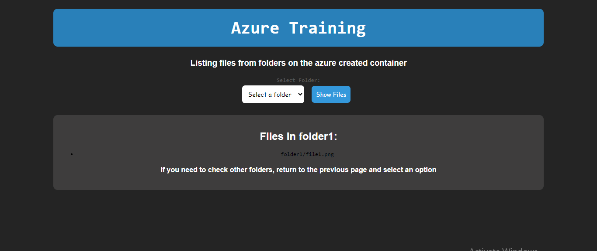

# Azure Fundamentals Assignment

This script has the basic flask web application which fetches the folders and files in the Azure Storage container and displays the files inside each folder which is selected.

This application is meant to be hosted on Azure Virtual machine as part of Azure Fundamentals Assignemnet.

1. Resource group used: mle-cloud-training
2. Storage Account : azuretrainingrishi
3. Virtual network : rishi-vn
4. Virtual Machine : rishi-training-vm

The inbound traffic for this web app hosted on the virtual machine is configured using Tiger VPN (IP:14.194.28.38)

## Screenshot the Flask web Application

